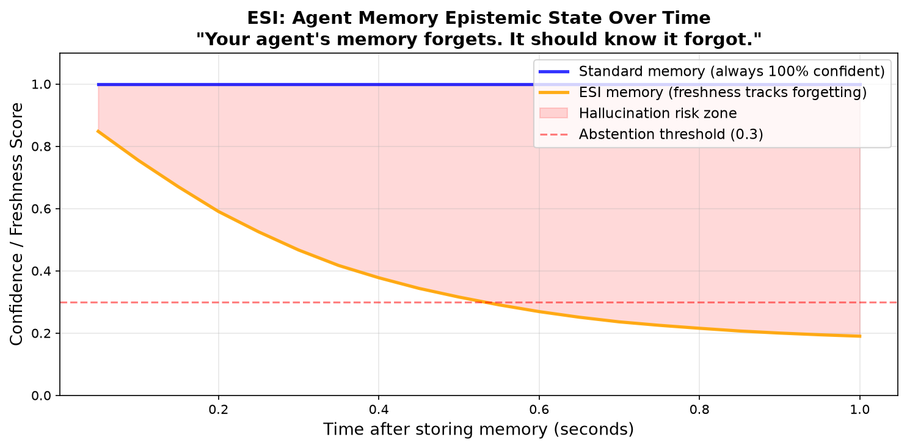

# esi — Epistemic State Interface

> **Your agent's memory forgets. It should know it forgot.**

[](https://badge.fury.io/py/esi-memory)
[](LICENSE)
[](https://www.python.org/downloads/)

---



---

AI agents forget things. That's fine. The problem is they don't know they forgot — so they answer with the same confidence whether a memory is fresh or years old.

**ESI** is a drop-in standard: any memory query returns not just *what* was remembered, but *how well* it was remembered.

```python
from esi import EpistemicMemory

mem = EpistemicMemory()
mem.add("The user prefers espresso coffee")

result = mem.query("What coffee does the user like?")
# Result(ANSWER | answer='The user prefers espresso coffee' | confidence=0.67 | freshness=1.00)

if result.should_abstain():
    print("I'm not sure — this memory may have degraded.")
else:
    print(result.answer)
```

---

## The problem

Current agent memory systems return:
```
"The user prefers espresso."
```

They don't tell you:
- How confident they are in the match
- How old (and potentially stale) this memory is
- Whether they should abstain instead of guessing

This produces the most dangerous hallucination: one stated with full confidence about degraded information.

## The solution

ESI proposes a standard return type for any memory query:

```python
Result(
    answer="espresso",
    confidence=0.72,    # how well does this match the query?
    freshness=0.91,     # how recent is this memory? (1.0 = just stored)
)
```

Works as a wrapper over any existing memory backend. Keep your Mem0, LangMem, or vector DB — just add epistemic state on top.

---

## Install

```bash
pip install esi-memory
```

Or from source:
```bash
git clone https://github.com/GhetauTudor/esi
cd esi
pip install -e .
```

## Quick start

```python
from esi import EpistemicMemory, SimpleMemoryBackend
import time

mem = EpistemicMemory(backend=SimpleMemoryBackend(max_age_seconds=3600))

mem.add("The user prefers espresso coffee")

# Fresh query — high confidence, high freshness
result = mem.query("What coffee does the user prefer?")
print(result)  # Result(ANSWER | confidence=0.67 | freshness=1.00)

time.sleep(1)  # memory ages...

# Stale query — same answer, but freshness drops
result = mem.query("What coffee does the user prefer?")
print(result.freshness)  # 0.4x — epistemic state reflects reality

# Unknown query — abstains automatically
result = mem.query("What is the capital of Mars?")
print(result.should_abstain())  # True
```

## How it works

**Confidence** measures how well the stored memory matches the query (keyword coverage). It answers: *did I find what was asked?*

**Freshness** decays exponentially with time and grows slightly with access frequency (reinforcement). It answers: *how much do I trust this memory is still accurate?*

Together they give the agent an epistemic score it can act on:

```python
result.epistemic_score()   # geometric mean of confidence × freshness
result.should_abstain()    # True if confidence < threshold (default 0.3)
```

---

## Architecture

```
Your agent
    │
    ▼
EpistemicMemory (wrapper)
    │  ← adds confidence + freshness to every query
    ▼
Any backend: SimpleMemoryBackend / Mem0 / LangMem / vector DB
```

ESI is a standard, not a framework. Implement `query() → Result` in your backend and you're compatible.

---

## Roadmap

- [x] `confidence` — query-memory keyword coverage
- [x] `freshness` — time + access decay
- [ ] `degradation` score — detect compressed/summarized memories ← **good first issue**
- [ ] `contradiction` detection — flag conflicting memories ← **help wanted**
- [ ] Mem0 backend integration
- [ ] LangMem backend integration
- [ ] `difficulty` estimation → energy-aware model routing

See [ROADMAP.md](ROADMAP.md) for details.

---

## Contributing

Contributions welcome — especially backend integrations and new epistemic dimensions.

See [CONTRIBUTING.md](CONTRIBUTING.md) for guidelines.

## Citation

If you use ESI in research, please cite:

```bibtex
@software{ghetau2026esi,
  author = {Ghetau, Tudor},
  title  = {ESI: Epistemic State Interface for Agent Memory},
  year   = {2026},
  url    = {https://github.com/GhetauTudor/esi}
}
```

## License

MIT © Tudor Ghetau
